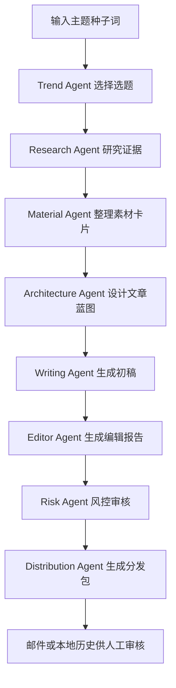

# ZhihuFlow Multi-Agent Content OS PRD

## 1. 背景

ZhihuFlow 现在已经具备从趋势发现、研究、写作、评估到邮件投递的基础 Agent 链路。但当前系统仍然偏“单条流水线”：研究产物直接进入写作，文章结构、素材组织、编辑修订、分发复用和复盘学习还没有被拆成独立职责。

如果要把 ZhihuFlow 做成真正有技术含量的求职项目和可长期使用的个人内容系统，它应该升级为 **Multi-Agent Content Operating System**：每个 Agent 负责一个清晰的认知角色，并留下可审计的中间产物。

## 2. 产品定位

ZhihuFlow Multi-Agent Content OS 是一个面向技术创作者的本地优先内容生产系统。它不是“让 AI 直接写文章”，而是把内容生产拆成选题、素材、研究、架构、写作、编辑、风控、分发和复盘等多个 Agent 协作阶段。

一句话定位：

> 帮技术创作者把 AI/Agent 热点转化为有证据、有结构、有判断、可复盘的多平台内容资产。

## 3. 目标用户

- 希望持续输出 AI/LLM/Agent 技术内容的个人创作者。
- 希望通过知乎技术文章建立专业信任的开发者。
- 希望把项目作为秋招/面试展示材料的学生或工程师。
- 对 Agent 工程架构、workflow replay、memory、eval、policy gate 感兴趣的技术读者。

## 4. 核心目标

1. 将单一内容生成链路升级为多 Agent 协作链路。
2. 让每个 Agent 的输入、输出、评价标准和 trace 都可审计。
3. 让文章质量从“模型临场发挥”变为“素材 + 论证 + 架构 + 编辑 + 风控”的系统结果。
4. 为后续 Web Console 展示 Agent 运行过程、产物和复盘数据打基础。
5. 保持本地优先和人工审核边界，不做自动发知乎、刷量或绕过平台风控。

## 5. 本期范围

本期交付后端第一阶段能力，优先实现可回放的多 Agent 产物链路。

### 5.1 本期新增 Agent

| Agent | 角色 | 核心职责 | 产物 |
| --- | --- | --- | --- |
| Trend Agent | 选题判断 | 从趋势卡片中选择最值得写的主题 | `TrendCard` |
| Material Agent | 素材整理 | 将来源和 claim 组织成可写素材卡片 | `MaterialBoard` |
| Research Agent | 证据研究 | 搜索资料、抽 claim、构建 claim graph | `ResearchBrief` |
| Architecture Agent | 文章架构 | 设计标题、主线、章节、代码/图表/表格位置 | `ArticleBlueprint` |
| Writing Agent | 初稿生成 | 基于 blueprint 和证据生成 Markdown 文章 | `ArticlePackage` |
| Editor Agent | 主编修订 | 检查 AI 味、结构弱点、技术元素缺失并给出 patch 建议 | `EditorialReport` |
| Risk Agent | 风控审核 | 检查商业夸大、证据不足、平台风险 | `PolicyReport` |
| Distribution Agent | 分发准备 | 生成多平台摘要、标题、封面 prompt 和审核 checklist | `DistributionPlan` |

### 5.2 本期不做

- 不接入知乎自动发布。
- 不做账号登录、Cookie 管理或验证码绕过。
- 不做真实社媒自动分发。
- 不做复杂多 Agent 争辩 UI。
- 不做云端多人协作。

## 6. 用户流程

## 7. 核心功能需求

### 7.1 素材 Agent

- 从 `ResearchBrief.sources` 和 `ResearchBrief.claims` 生成素材卡片。
- 每张卡片包含：观点、来源 ID、使用场景、可信度、可写角度、风险提示。
- 按类型聚类：evidence、case、counterpoint、implementation、risk。
- 将素材板作为 artifact 写入 SQLite。

### 7.2 架构 Agent

- 输入趋势、研究简报、素材板和写作配置。
- 输出文章蓝图：
  - 标题候选
  - 核心论点
  - H2/H3 结构
  - 开头策略
  - 代码块计划
  - 图表计划
  - 表格计划
  - CTA 和互动问题
- 蓝图要显式指导 Writer，而不是让 Writer 自己临场决定结构。

### 7.3 编辑 Agent

- 输入文章、蓝图和研究简报。
- 输出编辑报告：
  - 是否通过编辑检查
  - AI 味命中
  - 结构问题
  - 技术元素缺失
  - 建议修改项
- 本期不自动重写整篇文章，只生成可审计建议，避免过度改写导致证据漂移。

### 7.4 分发 Agent

- 输入最终文章、编辑报告、质量报告和风控报告。
- 输出分发包：
  - 知乎标题候选
  - 知乎摘要
  - 小红书短文版本
  - 朋友圈/README 项目介绍版本
  - 封面图 prompt
  - 发布前人工审核 checklist

### 7.5 Trace 与可回放

- 每个 Agent 都是 `JournaledWorkflow` 的一个 step。
- 每个产物都写入 `artifacts`。
- 每个关键动作都写入 `event_log`。
- 同一个 `trace_id` 重跑时可复用已完成步骤。

## 8. 质量指标

| 指标 | 目标 |
| --- | --- |
| 文章长度 | 中文 1500-2500 计数单位 |
| Markdown 结构 | 1 个 H1，至少 4 个 H2 |
| 技术元素 | 至少 2 个代码块，1 个 Mermaid/PlantUML，1 个表格 |
| 证据链 | 至少 3 个来源，claim 绑定 evidence_id |
| 编辑报告 | 必须给出 pass/fail 和建议 |
| 风控 | 不允许保证收益、自动发布、刷量、绕风控等表达 |
| 可回放 | 同 trace_id 重跑应触发 workflow replay |

## 9. 后续路线图

### 二期：复盘 Agent

- 读取文章采用情况、手动修改、反馈数据。
- 更新长期记忆中的写作偏好、标题偏好、主题偏好。
- 生成下一轮选题建议。

### 三期：Agent Debate

- 增加技术乐观派、工程怀疑派、商业视角、风险视角四个辩论 Agent。
- 架构 Agent 汇总辩论结果，生成更有判断感的文章主线。

### 四期：Web Review Studio

- 在 React 控制台展示每个 Agent 的产物。
- 支持查看素材卡片、文章蓝图、编辑报告、分发包。
- 支持人工采纳/拒绝编辑建议。
