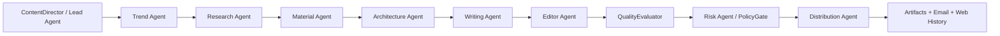

# ZhihuFlow Multi-Agent Content OS 技术方案

## 1. 总体架构

本次改造采用“Lead Agent 编排 + 专职 Agent 产物 + JournaledWorkflow 可回放”的架构。`ContentDirector` 继续作为 Lead Agent，但不再直接从 research 跳到 write，而是插入素材、架构、编辑和分发阶段。



## 2. 包结构

新增 `zhihuflow/agents/` 包，用于承载不同职责的 Agent，避免继续把所有编排逻辑塞进 `app/director.py`。

```text
zhihuflow/
  agents/
    __init__.py
    material.py
    architecture.py
    editor.py
    distribution.py
  app/
    director.py
  core/
    schemas.py
  content/
    writer.py
```

## 3. 数据模型

### 3.1 MaterialCard

```python
@dataclass
class MaterialCard:
    title: str
    summary: str
    material_type: str
    evidence_ids: list[str]
    use_case: str
    confidence: float
    risk_note: str = ""
    card_id: str = field(default_factory=lambda: new_id("mat"))
```

### 3.2 MaterialBoard

```python
@dataclass
class MaterialBoard:
    topic: str
    cards: list[MaterialCard]
    clusters: dict[str, list[str]]
    gaps: list[str]
    board_id: str = field(default_factory=lambda: new_id("board"))
```

### 3.3 ArticleBlueprint

```python
@dataclass
class ArticleBlueprint:
    topic: str
    title_candidates: list[str]
    core_thesis: str
    opening_strategy: str
    sections: list[ArticleSectionPlan]
    code_plans: list[str]
    diagram_plan: str
    table_plan: str
    analogy: str
    cta: str
    discussion_question: str
    blueprint_id: str = field(default_factory=lambda: new_id("blueprint"))
```

### 3.4 EditorialReport

```python
@dataclass
class EditorialReport:
    passed: bool
    ai_flavor_hits: list[str]
    structure_notes: list[str]
    missing_elements: list[str]
    revision_suggestions: list[str]
    editor_version: str = "editor-agent-v1"
```

### 3.5 DistributionPlan

```python
@dataclass
class DistributionPlan:
    zhihu_titles: list[str]
    zhihu_summary: str
    xiaohongshu_post: str
    social_post: str
    cover_prompt: str
    review_checklist: list[str]
    plan_id: str = field(default_factory=lambda: new_id("dist"))
```

## 4. Workflow 改造

当前步骤：

```text
discover_trends -> choose_trend -> research -> write_article -> evaluate_quality -> policy_check
```

改造后步骤：

```text
discover_trends
  -> choose_trend
  -> research
  -> build_material_board
  -> design_article_blueprint
  -> write_article
  -> edit_article
  -> evaluate_quality
  -> policy_check
  -> prepare_distribution
```

每个新增步骤都要：

- 写 `event_log`
- 写 `workflow_journal`
- 产物写入 `artifacts`
- 支持同 `trace_id` replay

## 5. Agent 职责设计

### 5.1 MaterialAgent

输入：`TrendCard`、`ResearchBrief`

输出：`MaterialBoard`

规则：

- 将 claim 转成 evidence/counterpoint/implementation/risk 等类型素材。
- 将 source 转成可引用素材。
- 如果来源少于 3 个，标记 gap。
- 输出按 `clusters` 组织，供后续架构 Agent 使用。

### 5.2 ArchitectureAgent

输入：`TrendCard`、`ResearchBrief`、`MaterialBoard`、`DirectorConfig`

输出：`ArticleBlueprint`

规则：

- 生成 3 个标题候选。
- 生成一个核心 thesis。
- 规划 5-7 个章节。
- 强制规划代码块、Mermaid 图、总结表格、生活化比喻。
- 将 CTA 和互动问题前置给 Writer。

### 5.3 EditorAgent

输入：`ArticlePackage`、`ArticleBlueprint`

输出：`EditorialReport`

规则：

- 复用 `detect_ai_flavor`。
- 检查 H1/H2、代码块、图表、表格、参考来源。
- 生成 revision suggestions。
- 本期不直接重写正文，避免引入二次幻觉。

### 5.4 DistributionAgent

输入：`ArticlePackage`、`QualityReport`、`PolicyReport`、`EditorialReport`

输出：`DistributionPlan`

规则：

- 生成知乎标题候选和摘要。
- 生成小红书短文、社交平台短文。
- 生成封面图 prompt。
- 生成发布前人工审核 checklist。

## 6. Writer 接口改造

`ZhihuWriter.write` 增加可选 `blueprint` 和 `materials` 参数：

```python
def write(
    self,
    trend: TrendCard,
    research: ResearchBrief,
    trace_id: str,
    config: DirectorConfig,
    blueprint: Optional[ArticleBlueprint] = None,
    materials: Optional[MaterialBoard] = None,
) -> ArticlePackage:
```

Writer prompt 中追加：

- 文章蓝图
- 素材卡片摘要
- 必须遵守 blueprint 的标题、章节、技术元素规划

## 7. 存储策略

不新增数据库表，继续使用泛化 artifact：

| kind | payload |
| --- | --- |
| `material_board` | `MaterialBoard` |
| `article_blueprint` | `ArticleBlueprint` |
| `article_markdown` | `ArticlePackage` |
| `editorial_report` | `EditorialReport` |
| `quality_report` | `QualityReport` |
| `policy_report` | `PolicyReport` |
| `distribution_plan` | `DistributionPlan` |

理由：当前系统处于本地产品原型阶段，artifact 已能满足可审计和 replay；新增表会增加迁移复杂度。

## 8. 测试方案

### 8.1 单元测试

- `MaterialAgent` 能生成素材板和 clusters。
- `ArchitectureAgent` 能生成含代码/图表/表格计划的蓝图。
- `EditorAgent` 能识别缺失技术元素。
- `DistributionAgent` 能生成分发计划和 checklist。

### 8.2 端到端测试

扩展现有 `test_pipeline_generates_article_with_trace`：

- artifacts 包含 `material_board`
- artifacts 包含 `article_blueprint`
- artifacts 包含 `editorial_report`
- artifacts 包含 `distribution_plan`
- event log 包含对应 Agent 完成事件
- replay 能复用新增步骤

### 8.3 验证命令

```bash
python3 -m compileall -q zhihuflow
python3 -m unittest discover -s tests -v
```

## 9. 风险与取舍

| 风险 | 影响 | 对策 |
| --- | --- | --- |
| 链路变长导致复杂度上升 | 调试成本增加 | 继续使用 `JournaledWorkflow`，每步可 replay |
| Agent 产物互相重复 | prompt 冗余 | 每个 Agent 只输出结构化中间产物 |
| Writer 忽略 blueprint | 文章结构不稳定 | prompt 强约束 + fallback + editor 检查 |
| 分发文案过度营销 | 风控风险 | DistributionAgent checklist + PolicyGate |
| 本期范围过大 | 交付风险 | 复盘 Agent、辩论 Agent 和 UI 展示进入二期 |

## 10. 分阶段实施计划

### Phase 1：后端 Agent 链路

- 新增 schemas。
- 新增 agents 包。
- 接入 `ContentDirector` workflow。
- 修改 Writer 接收 blueprint/materials。
- 补测试。

### Phase 2：复盘 Agent

- 将反馈事件沉淀为长期偏好。
- 反向影响趋势选择和文章架构。

### Phase 3：Agent Debate

- 引入观点辩论产物。
- 架构 Agent 从辩论结果提炼主线。

### Phase 4：Web Review Studio

- React 控制台展示每个 Agent 的产物。
- 支持人工采纳编辑建议和导出分发包。
