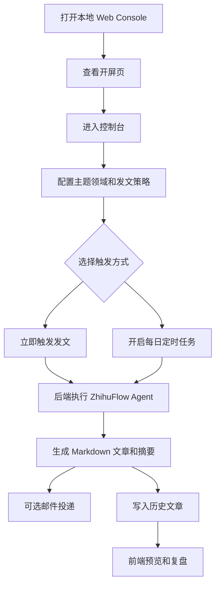

## 1. 产品概述

ZhihuFlow Web Console 是 ZhihuFlow Agent 的本地可视化控制台，用于把「定时发文、主题配置、手动触发、历史文章复盘」从 CLI 操作升级为可交互页面。
- 目标用户是项目作者和演示项目的面试官/评审者，核心价值是展示 Agent 产品化能力，而不是只展示命令行脚本。
- 页面必须保持本地优先，不引入账号登录、云端用户体系或自动发布到知乎的风险能力。

## 2. 核心功能

### 2.1 功能模块

1. **开屏页**：品牌叙事、炫酷视觉动效、进入控制台入口。
2. **运行控制台**：开启/关闭每日发文，设置定时时间，设置字数范围，设置邮箱投递开关，手动触发发文。
3. **主题领域配置**：编辑 AI/LLM/Agent 等搜索种子词，保存为本地配置。
4. **运行状态监控**：展示当前任务状态、历史文章数量、邮箱配置状态、最近运行日志。
5. **历史文章复盘**：展示历史生成文章、主题、质量分、风险等级、投递状态，并支持 Markdown 预览。

### 2.2 页面详情

| 页面名称 | 模块名称 | 功能描述 |
| --- | --- | --- |
| 开屏页 | 品牌主视觉 | 通过暗色科技感、轨道动画、扫描线和强标题展示 ZhihuFlow 的 Agent 产品定位 |
| 控制台首页 | 发文控制 | 保存每日任务开关、定时时间、字数范围、离线模式和邮箱投递开关 |
| 控制台首页 | 主题领域 | 支持多行输入，最多保存 12 个搜索种子词 |
| 控制台首页 | 运行状态 | 轮询后端 `/api/status`，展示 idle/running/completed/failed 状态 |
| 控制台首页 | 历史文章 | 读取 `/api/history`，支持点击查看 `/api/articles/:trace_id` 的 Markdown 内容 |

## 3. 核心流程

用户进入 Web Console 后，先查看开屏页，再进入控制台配置主题和发文策略。保存配置后，可以选择立即触发一次 Agent 发文，也可以开启每日定时任务。Agent 运行结束后，历史列表自动出现文章记录，用户可以预览文章并判断是否手动发布到知乎。

## 4. 用户界面设计

### 4.1 设计风格

- 主色：近黑蓝背景 `#07090f`，青色高亮 `#55f5ff`，暖金点缀 `#f8d26a`。
- 按钮：大圆角胶囊按钮，主按钮使用高对比渐变，次按钮使用玻璃态描边。
- 字体：中文优先使用系统中文字体，标题使用更紧凑的 display 风格字重，正文保持清晰可读。
- 布局：桌面优先，左侧导航 + 右侧仪表盘；移动端折叠为单列卡片。
- 组件库：采用开源组件库 Radix UI 作为无样式可访问组件基础，并用 Tailwind CSS 统一视觉系统。
- 动效：开屏页保留轨道、扫描线和渐变网格；控制台使用 hover、状态点和历史卡片微动效。

### 4.2 页面设计概览

| 页面名称 | 模块名称 | UI 元素 |
| --- | --- | --- |
| 开屏页 | 主视觉 | 中央玻璃卡片、旋转轨道、扫描线、品牌标题、进入按钮 |
| 控制台首页 | 侧边栏 | Logo、导航锚点、Agent 状态点 |
| 控制台首页 | 发文控制卡片 | Switch、Time input、Number input、Checkbox、保存按钮 |
| 控制台首页 | 状态卡片 | 当前任务、历史数量、当前时间、终端日志 |
| 控制台首页 | 主题卡片 | Textarea、提示文案、保存联动 |
| 控制台首页 | 历史列表 | 卡片列表、Badge、质量分、风险等级、预览 Dialog |

### 4.3 响应式

采用桌面优先设计。宽屏展示侧边栏和 12 栅格仪表盘；窄屏下侧边栏变为顶部块，控制卡片、状态卡片、主题卡片和历史列表改为单列排列。所有按钮和输入控件保留足够点击区域，支持触屏操作。
