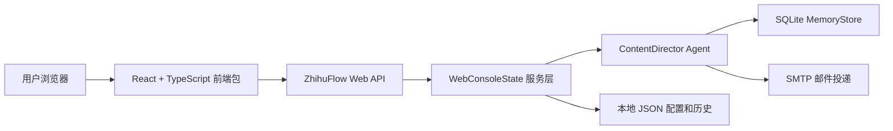
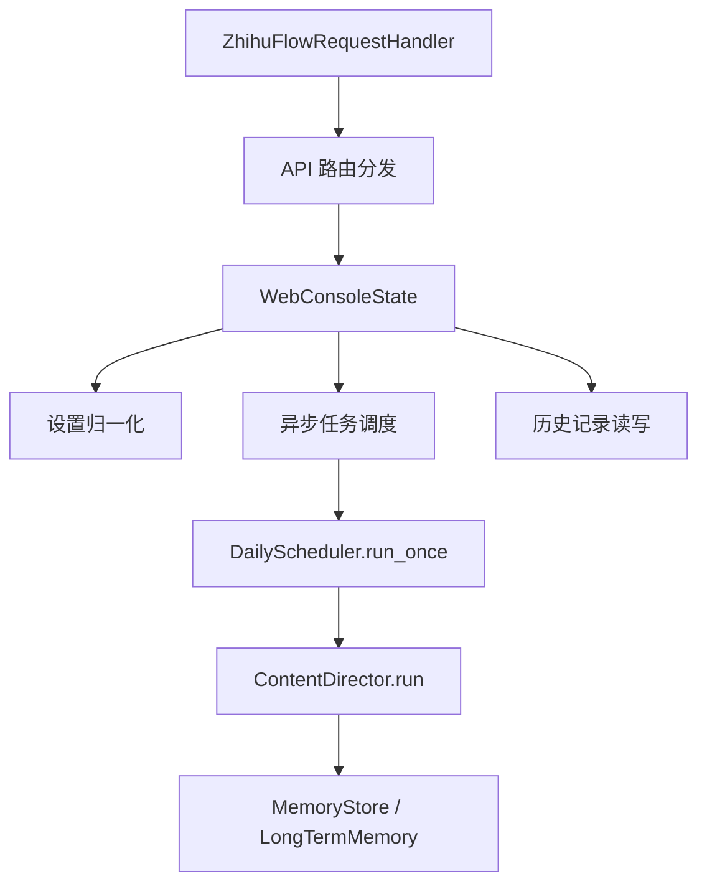

## 1. 架构设计



前端作为同项目的独立包放在 `zhihuflow/web/frontend/`，由 Vite 构建到 `zhihuflow/web/static/`。Python Web 服务继续负责 API 和静态资源托管，保证用户仍然通过 `python3 -m zhihuflow.cli web` 启动完整控制台。

## 2. 技术说明

- 前端：React 18 + TypeScript + Vite。
- 样式：Tailwind CSS 3，使用 CSS 变量承载 ZhihuFlow 暗色科技主题。
- 开源组件库：Radix UI，用于 Switch、Dialog、Label 等可访问交互组件。
- 辅助库：`lucide-react` 用于图标，`clsx` 用于 className 组合。
- 初始化工具：Vite React TypeScript 模板。
- 后端：保留 Python 标准库 `ThreadingHTTPServer`，不新增 Python Web 框架。
- 构建产物：`npm run build` 输出到 `zhihuflow/web/static/`，由现有 `ZhihuFlowRequestHandler` 托管。

## 3. 路由定义

| 路由 | 用途 |
| --- | --- |
| `/` | React 单页控制台入口，包含开屏页和控制台 |
| `/#control` | 发文控制区域锚点 |
| `/#topics` | 主题领域配置锚点 |
| `/#history` | 历史文章区域锚点 |

前端不引入 React Router，当前需求只有一个控制台页面，使用锚点即可减少复杂度。

## 4. API 定义

```ts
export interface WebSettings {
  schedule_enabled: boolean;
  email_delivery_enabled: boolean;
  offline: boolean;
  daily_at: string;
  seeds: string[];
  min_chars: number;
  max_chars: number;
}

export interface CurrentJob {
  job_id?: string;
  status: "idle" | "running" | "completed" | "failed";
  reason?: "manual" | "schedule";
  trace_id?: string;
  started_at?: string;
  finished_at?: string;
  error?: string;
}

export interface WebStatus {
  app: "ZhihuFlow";
  now: string;
  settings: WebSettings;
  email_configured: boolean;
  current_job: CurrentJob;
  history_count: number;
}

export interface HistoryRecord {
  trace_id: string;
  title: string;
  topic: string;
  created_at: string;
  reason: "manual" | "schedule";
  article_path: string;
  summary_path: string;
  quality?: number;
  risk?: string;
  delivered: boolean;
  delivery_message?: string;
}
```

| 方法 | 路径 | 请求体 | 响应 |
| --- | --- | --- | --- |
| GET | `/api/status` | 无 | `WebStatus` |
| GET | `/api/settings` | 无 | `WebSettings` |
| POST | `/api/settings` | `Partial<WebSettings>` | `WebSettings` |
| POST | `/api/run` | `{}` | `CurrentJob` |
| GET | `/api/history` | 无 | `HistoryRecord[]` |
| GET | `/api/articles/:trace_id` | 无 | `text/markdown` |

## 5. 服务端架构图



## 6. 前端包结构

```text
zhihuflow/web/frontend/
  package.json
  tsconfig.json
  vite.config.ts
  tailwind.config.js
  postcss.config.js
  index.html
  src/
    main.tsx
    App.tsx
    api.ts
    types.ts
    components/
      Button.tsx
      Card.tsx
      Field.tsx
      SplashScreen.tsx
      ConsoleShell.tsx
      HistoryList.tsx
      ArticlePreviewDialog.tsx
    styles/
      globals.css
```

## 7. 数据模型

当前 Web 控制台不新增数据库表，继续使用本地 JSON 和现有 SQLite：

- `.zhihuflow/web_settings.json`：保存 Web 设置。
- `.zhihuflow/web_history.json`：保存最多 200 条 Web 触发历史。
- `.zhihuflow/web_runs/`：保存 Web 生成的 Markdown 文章和 JSON 摘要。
- `.zhihuflow/zhihuflow.sqlite3`：继续保存 Agent event log、workflow journal、artifacts、claims 和 claim graph。

## 8. 验证策略

- 前端：运行 `npm run build` 验证 TypeScript 和 Vite 构建。
- 后端：运行 `python3 -m compileall -q zhihuflow`。
- 单测：运行 `python3 -m unittest discover -s tests -v`。
- 启动验证：短暂启动 `python3 -m zhihuflow.cli web`，请求 `/api/status` 和 `/`，确认 API 与构建产物可访问。
