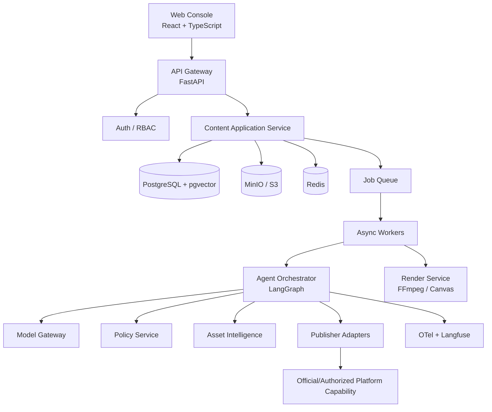
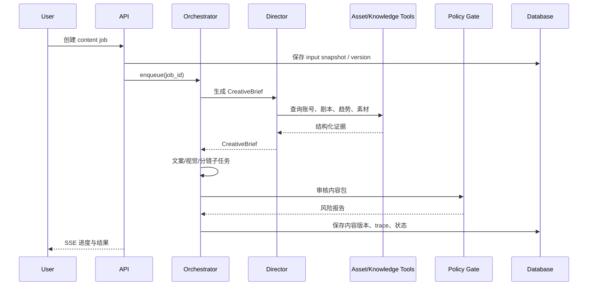
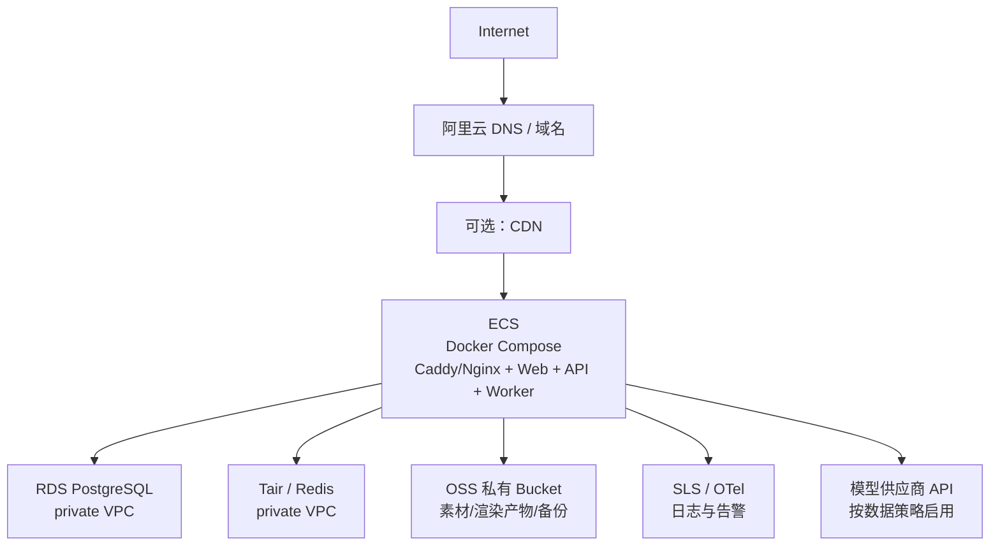

# 系统架构设计

## 1. 架构目标

- 让内容生产工作流可暂停、恢复、重试、审计。
- 将平台连接器、模型供应商和渲染能力与核心业务解耦。
- 让多模态处理走异步队列，避免阻塞用户请求。
- 支持从单人本地开发平滑扩展到小团队托管部署。

## 2. 总体架构

## 3. 服务职责

| 模块 | 职责 | 不负责 |
| --- | --- | --- |
| API | 认证、资源 CRUD、任务触发、SSE 进度 | 长时间模型推理 |
| Content Service | 内容版本、审核、日历、业务规则 | 直接访问模型供应商 |
| Agent Orchestrator | 执行状态图、调用工具、持久化状态 | 直接处理 HTTP 鉴权 |
| Model Gateway | 模型路由、限额、重试、脱敏、缓存 | 业务决策 |
| Asset Service | 上传、转码、OCR、Embedding、权利元数据 | 内容发布 |
| Policy Service | 风险扫描、规则、证据校验、拦截 | 取代人工法务判断 |
| Publisher | 草稿导出、授权发布适配、幂等与回执 | 模拟登录或规避平台限制 |
| Analytics | 导入授权数据、聚合指标、实验归因 | 伪造或推测平台数据 |

## 4. 核心内容生成时序

## 5. 关键架构决策

### ADR-001：采用状态图而非自由群聊

内容生产有明确依赖：先有 Brief，才生成执行内容；先完成审核，才可进入发布。状态图使重试、版本、人工中断和评测更可控。多 Agent 只在职责明确时使用。

### ADR-002：发布端使用适配器模式

`Publisher` 定义统一契约：`validate()`、`prepare_draft()`、`publish()`、`get_status()`。MVP 实现 `ExportPublisher` 和 `AssistedSharePublisher`；任何平台直发实现均需在配置中显示其授权状态。

### ADR-003：所有生成都是版本化资产

内容的输入、Prompt、模型、输出、审核结果均不可原地覆盖。编辑后创建新 `content_version`，保证可回放和责任追踪。

### ADR-004：长任务事件化

上传处理、OCR、视频渲染、模型调用、批量评测均进入队列。API 只返回 job id，前端通过 SSE/WebSocket 订阅进度。

## 6. 本地与生产部署拓扑

### 本地开发

Docker Compose 启动 web、api、worker、postgres、redis、minio、mailpit（可选）和 langfuse（可选）。本地服务通过 Docker 网络互联；只暴露 web、api、MinIO 控制台等开发必要端口。所有外部模型调用由 `.env.local` 显式开启。

### 首期生产：单 ECS + 托管数据服务

ECS 只承载无状态应用、队列 worker、反向代理和一次性迁移任务；数据库、Redis 和原始多媒体不放在 ECS 磁盘。ECS 与 RDS/Tair 放入同一 VPC，安全组只允许 ECS 安全组访问数据库私网端口。详见[部署运行手册](11-deployment-runbook.md)。

### 扩展生产：多 ECS / 容器平台

当 worker 的视频渲染或模型任务挤占 API，先拆出单独的 worker ECS；之后再迁移到 ACK 或容器计算服务。无论如何，RDS、OSS、Tair 的连接契约不变，应用镜像保持无状态。

## 7. 可观测性

每个请求贯穿 `request_id`、`content_id`、`job_id`、`trace_id`、`tenant_id`。记录：模型/工具调用、token、成本、延迟、重试、政策命中、人工审批和发布回执。不得把原始敏感素材或密钥写入 trace。
