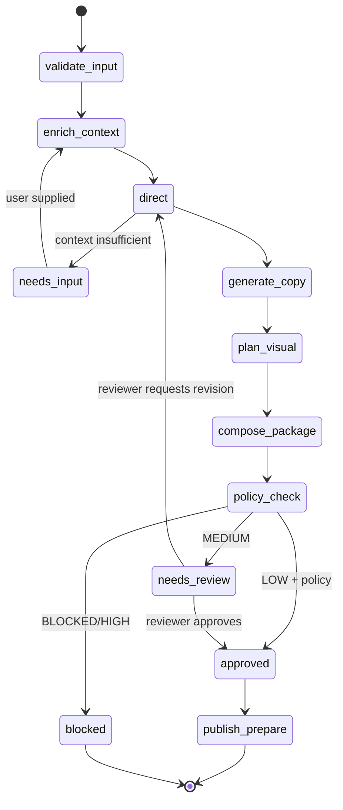

# Agent 与模型设计

## 1. 设计原则

- 导演负责决策和编排；专长 Agent 负责受限执行；Policy Gate 独立否决。
- 使用结构化输出和 JSON Schema；任何解析失败均不能进入写操作。
- 模型没有发布权限、数据库写权限或任意网络权限。
- 每步都附带输入版本、证据和置信度。

## 2. Agent 角色

| 角色 | 职责 | 输入 | 输出 | 可用工具 |
| --- | --- | --- | --- | --- |
| Trend Scout | 发现并归一化趋势 | 授权趋势源、赛道词库 | TrendCard | trend search, dedupe |
| Content Director | 形成创意简报和委派计划 | TrendCard、账号、剧本、素材、目标 | CreativeBrief | retrieval, asset search, budget check |
| Writer | 生成标题、正文、话题、口播 | CreativeBrief、事实证据 | CopyPackage | fact retrieval, style validator |
| Visual Planner | 生成封面/图文/视频分镜与素材清单 | CreativeBrief、资产标签 | Storyboard | asset search, layout templates |
| Compliance Gate | 独立评估政策、事实、版权与隐私风险 | ContentPackage | PolicyReport | policy rules, assertion checker |
| Publisher | 导出/辅助发布 | ApprovedContent | PublishReceipt | approved publisher adapter only |
| Analyst | 复盘授权数据并提出实验建议 | analytics snapshots | LearningCard | aggregate metrics |

## 3. 导演 Agent

导演不是万能生成器；它必须输出可验证的 `CreativeBrief`，并由状态机解析委派任务。

```json
{
  "brief_version": "1.0",
  "objective": "drive_store_visit",
  "chosen_angle": "下班后一小时的冰咖啡休息点",
  "audience": "附近 20-30 岁白领",
  "why_now": [{"trend_id":"tr_21","claim":"高温+下班场景","captured_at":"..."}],
  "format": "short_video",
  "hook": "不是所有冰咖啡都适合夏天续命",
  "narrative_beats": ["场景", "细节证明", "适用人群", "轻 CTA"],
  "asset_plan": [{"asset_id":"asset_1","role":"opening"}],
  "delegations": ["writer", "visual_planner"],
  "risk_hypotheses": ["避免医疗/功效表达"],
  "budget": {"max_model_cost_cny": 3, "max_image_generations": 2},
  "confidence": 0.82,
  "needs_user_input": false
}
```

若缺少真实产品信息、可用素材或热点证据，导演输出 `needs_user_input=true`，而非虚构补全。

## 4. 状态机



## 5. 模型路由

| 任务 | 模型类别 | 原因 | 兜底 |
| --- | --- | --- | --- |
| 意图/风险预筛 | 小型文本模型/规则 | 低成本、高吞吐 | 规则优先 |
| 创意导演、复杂改写 | 强推理文本模型 | 需综合上下文和约束 | 进入人工 Brief |
| OCR/图像标签 | 视觉模型 + OCR 引擎 | 多模态理解 | 用户编辑标签 |
| 封面/氛围图 | 图像生成模型 | 视觉补充 | 模板 + 用户素材 |
| 视频编排 | 文本模型 + FFmpeg | 结果可复现 | 输出 shot list |
| 合规判定 | 规则 + 分类器 + 强模型复核 | 降低单模型漏检 | 人工拦截 |

`ModelGateway` 根据租户预算、任务等级和延迟目标选择供应商。调用前做 PII 脱敏；调用后验证 JSON；记录成本但不记录密钥。

## 6. Prompt 工程规范

- System Prompt 只描述职责、边界、Schema 和拒绝条件。
- 用户上传内容一律视为不可信数据，不得改变系统/工具权限。
- 事实断言必须关联 `evidence_id`；无证据时返回 `unverified`。
- 不要求或存储模型的隐藏推理过程；Trace 记录可解释的计划、工具调用与结果摘要。
- Prompt 和模型参数通过版本化配置管理，禁止在业务代码中硬编码。

## 7. 工具白名单

导演可读：账号、剧本、趋势、内容历史、资产元数据、预算。  
文案可读：已批准的事实和 Brief。  
视觉可读：经许可的素材与模板。  
合规可读：内容包、规则、资产权利。  
发布器只接收 `APPROVED` 内容版本，且不向模型暴露认证令牌。
