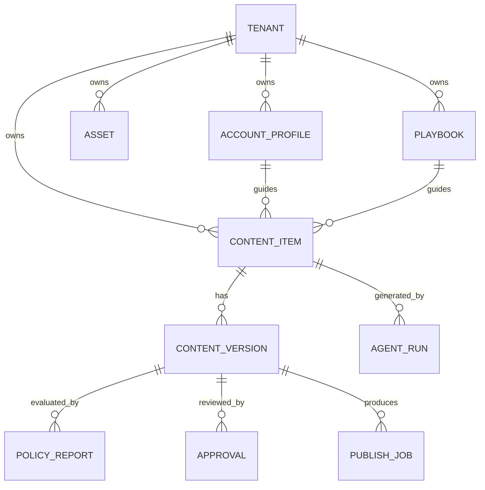

# 数据与接口设计

## 1. 核心实体



## 2. 表设计摘要

| 表 | 关键字段 |
| --- | --- |
| `tenants` | id, name, plan, status |
| `memberships` | tenant_id, user_id, role |
| `account_profiles` | id, tenant_id, name, persona_json, audience_json, brand_facts_json, version |
| `playbooks` | id, tenant_id, name, schema_json, version, status |
| `assets` | id, tenant_id, type, object_key, rights_status, tags_json, ocr_text, embedding |
| `trend_cards` | id, tenant_id nullable, topic, sources_json, captured_at, heat_score, fit_score, risk_score, expires_at |
| `content_items` | id, tenant_id, account_profile_id, state, objective, current_version_id |
| `content_versions` | id, content_item_id, version_no, input_snapshot_json, creative_brief_json, package_json, created_by |
| `policy_reports` | id, content_version_id, overall_risk, findings_json, policy_version |
| `approvals` | id, content_version_id, status, reviewer_id, note, decided_at |
| `agent_runs` | id, tenant_id, content_version_id, trace_id, graph_version, status, cost_cny |
| `publish_jobs` | id, content_version_id, adapter, idempotency_key, status, external_ref, scheduled_at |
| `analytics_snapshots` | id, content_item_id, source, metric_at, metrics_json |

所有业务表使用 UUID 主键、`created_at`、`updated_at`；租户表使用复合索引 `(tenant_id, created_at)`。含敏感信息的文本按最小化原则存储，并有过期清理任务。

## 3. API 原则

- URL 使用 `/api/v1`；资源读写遵循 REST，长任务使用 job。
- 写接口要求 `Idempotency-Key`。
- 所有资源访问从 JWT 中得到 tenant 和 role，不能信任客户端的 tenant_id。
- 返回错误使用 RFC 7807 风格：`type / title / status / detail / request_id`。

## 4. 核心 API

| Method | Path | 说明 |
| --- | --- | --- |
| POST | `/content-items` | 创建内容任务 |
| POST | `/content-items/{id}/generate` | 排队生成指定阶段 |
| GET | `/content-items/{id}` | 读取内容与当前版本 |
| POST | `/content-versions/{id}/review` | 提交审核 |
| POST | `/content-versions/{id}/approve` | 审批通过/拒绝 |
| POST | `/content-versions/{id}/publish-jobs` | 创建草稿/辅助发布任务 |
| POST | `/assets/upload-url` | 获取直传 URL |
| GET | `/trends` | 获取趋势卡片 |
| POST | `/playbooks` | 创建/版本化剧本 |
| GET | `/agent-runs/{id}` | 查看可解释 Trace 摘要 |
| GET | `/events/stream` | SSE 任务进度 |

### 创建内容任务示例

```json
POST /api/v1/content-items
{
  "account_profile_id": "acct_...",
  "playbook_id": "pb_...",
  "trend_card_id": "trend_...",
  "objective": "drive_store_visit",
  "requested_format": "image_post",
  "asset_ids": ["asset_1", "asset_2"],
  "user_notes": "突出新品冰滴，但不要写功效"
}
```

### 内容包响应示例

```json
{
  "content_id": "cnt_...",
  "state": "NEEDS_REVIEW",
  "version": 3,
  "creative_brief": {"chosen_angle": "..."},
  "package": {"titles": ["..."], "body": "...", "storyboard": []},
  "policy": {"risk": "MEDIUM", "findings": []},
  "trace_id": "trace_..."
}
```

## 5. 领域事件

`AssetUploaded`、`AssetAnalyzed`、`TrendImported`、`ContentGenerationRequested`、`CreativeBriefReady`、`ContentPackageReady`、`PolicyChecked`、`ReviewDecided`、`PublishPrepared`、`PublishSucceeded`、`PublishFailed`、`AnalyticsImported`。

消费者必须幂等；事件 payload 只传引用和必要元数据，原始大文件存对象存储。
