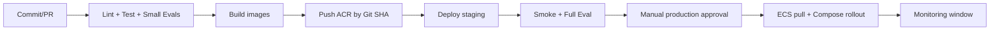

# 本地与阿里云 ECS 部署运行手册

本文定义 RedFlow 从本地开发到阿里云线上部署的唯一推荐路径。目标是先以合理成本获得可靠的单区域线上服务，再在真实负载出现后拆分和扩容。

## 1. 环境分层

| 环境 | 目的 | 计算 | 数据 | 域名 |
| --- | --- | --- | --- | --- |
| local | 日常开发与模型试验 | 本机 Docker Compose | 容器 PostgreSQL/Redis/MinIO | localhost |
| staging | 联调、验收、Demo | 现有 ECS 或独立轻量 ECS | 可共用非生产 RDS/OSS/Tair，逻辑隔离 | `staging.redflow.example.com` |
| production | 真实用户 | ECS 应用容器 | 独立 RDS/OSS/Tair | `app.redflow.example.com` |

生产与 staging 不共用数据库、OSS bucket、OAuth 应用回调或模型预算。至少从逻辑上隔离；有条件时用独立阿里云账号或资源组。

## 2. 阿里云资源清单

| 服务 | 生产建议 | 用途 | 必要性 |
| --- | --- | --- | --- |
| ECS | 2 vCPU / 4–8 GB 起；系统盘 ESSD；Ubuntu LTS 或 Alibaba Cloud Linux | Caddy/Nginx、Web、API、Worker、迁移任务 | 必须（已有） |
| VPC + vSwitch | ECS/RDS/Tair 同地域同 VPC | 私网通信与安全组隔离 | 必须 |
| RDS PostgreSQL | PostgreSQL 16/17；生产选高可用系列；开启自动备份 | 业务库、pgvector、审计数据 | 正式线上必须 |
| OSS | 私有 Bucket，按 env 分 Bucket | 原素材、转码、导出内容、备份 | 真实素材前必须 |
| Tair（Redis 开源版） | 标准双副本；禁公网 | 队列、限流、任务状态、缓存 | 正式异步任务必须 |
| ACR | 私有命名空间与镜像仓库 | CI 构建和 ECS 拉取镜像 | 强烈推荐 |
| SLS | Project + Logstore | 应用/访问日志、告警 | 强烈推荐 |
| 云监控 | ECS/RDS/Tair/OSS 指标告警 | 容量、CPU、内存、连接数 | 强烈推荐 |
| DNS / SSL | 域名解析、证书 | HTTPS 和回调 URL | 对外服务必须 |
| KMS / Secrets Manager | 密钥托管与轮换 | 生产 secrets | 推荐，上线前完成 |

没有预算时，ECS 可以临时自托管 PostgreSQL/Redis/MinIO 仅用于演示；但只要开始存放真实用户资料或对外开放，就应迁移到 RDS/OSS/Tair。**不要把原始媒体和数据库唯一副本留在 ECS 系统盘。**

## 3. VPC、网络和安全组

### 网络原则

- ECS、RDS、Tair 使用同一地域、同一 VPC 的私网地址。
- RDS、Tair 不分配公网地址；只允许来自 `sg-redflow-app` 的入站连接。
- OSS bucket 设为私有；使用 RAM 授权和预签名 URL，而不是永久公网链接。
- ECS 仅开放 `80/443` 到互联网；`22` 仅允许你的固定管理 IP，推荐改用 ECS Workbench/堡垒机。
- 数据库端口 `5432`、Redis `6379` 不对公网开放。

### 建议安全组

| 安全组 | 入站 | 出站 |
| --- | --- | --- |
| `sg-redflow-app` | 80/443: 0.0.0.0/0；22: 管理 IP | 443 到模型/镜像/OSS；5432 到 RDS SG；6379 到 Tair SG |
| `sg-redflow-rds` | 5432: `sg-redflow-app` | 默认 |
| `sg-redflow-tair` | 6379: `sg-redflow-app` | 默认 |

## 4. 数据服务配置

### RDS PostgreSQL

1. 选择与 ECS 相同地域/VPC；创建生产独立实例。
2. 创建 `redflow_app` 运行账号和 `redflow_migration` 迁移账号；不使用高权限管理员账号运行应用。
3. 启用 SSL，启用自动备份和至少 7–14 天备份保留期；配置备份窗口避开业务高峰。
4. 在迁移中启用所需扩展（例如 `vector`、`pg_trgm`，以实例扩展列表为准）。
5. 配置连接池：API 使用小连接池，Worker 独立连接池；设置 `statement_timeout`。
6. 每季度演练一次从备份恢复到临时实例，并记录 RTO/RPO。

RDS 基础系列适合个人学习和开发测试；正式生产优先高可用系列，因为其具备主备和自动故障切换能力。[阿里云 RDS PostgreSQL 产品系列](https://help.aliyun.com/zh/rds/apsaradb-rds-for-postgresql/product-editions/)

### OSS

Bucket 建议：`redflow-prod-assets`、`redflow-prod-exports`、`redflow-prod-backups`。不要将 staging 与 production 混在同一 Bucket。

- 开启版本控制（至少 exports/backups）；配置生命周期：临时渲染文件 7 天删除、原始素材按用户/合同策略保留、旧版本转低频/归档。
- 使用 Server-Side Encryption；Bucket policy 默认拒绝匿名访问。
- 浏览器上传走后端签发的短时 STS 或预签名 URL，限制 object key 前缀、Content-Type 和最大大小。
- 定期验证生命周期策略不会误删仍被内容版本引用的资产。

### Tair（Redis）

- 生产选 Redis 开源版标准双副本或更高；单副本仅用于纯缓存，不可承载任务可靠性。
- key 命名：`rf:{env}:{tenant}:{domain}:{id}`；队列和限流 key 必须有 TTL 与容量告警。
- 配置 TLS（可用时）、白名单/安全组、认证与连接池；不开放公网。

## 5. ECS 应用部署

### 容器组成

```text
proxy      Caddy 或 Nginx：TLS、反向代理、静态安全头
web        React 构建产物（可由 proxy 托管）
api        FastAPI：HTTP、SSE、认证、业务 API
worker     异步任务：Agent、OCR、渲染、队列消费
beat       定时任务：清理、趋势刷新、备份校验
```

生产 Compose **不** 启动 PostgreSQL、Redis、MinIO；它们由 RDS/Tair/OSS 提供。应用镜像从 ACR 拉取，所有服务使用不可变 tag（Git SHA），禁止使用 `latest`。

### 部署步骤

1. 在 ACR 创建私有仓库；CI 构建 `web/api/worker` 镜像，打 `git-sha` 与 release tag。
2. 在 ECS 安装 Docker Engine 与 Compose plugin。阿里云官方文档说明了 Docker Compose plugin 的安装和以 Compose 部署多服务的方法。[ECS Docker Compose 指南](https://help.aliyun.com/en/ecs/user-guide/install-and-use-docker)
3. 创建受限 Linux 用户 `redflow`；部署目录如 `/opt/redflow`；`.env.production` 权限设为 `600`。
4. 配置 ACR 登录、`compose.production.yml`、Caddy/Nginx 站点和健康检查。
5. 首次执行 `alembic upgrade head`；验证数据库扩展、OSS 写入、Tair ping。
6. `docker compose pull && docker compose up -d --remove-orphans`。
7. 运行 smoke test：`/healthz`、`/readyz`、登录、上传测试文件、创建一条 mock 内容任务。
8. 确认 SLS、Langfuse 和云监控均收到事件后再切换 DNS。

### 健康检查

- `/healthz`：进程存活，不访问外部依赖。
- `/readyz`：检查 RDS、Tair、OSS 配置是否可用；模型供应商只做配置检查，不每次发送真实请求。
- Worker 心跳写入 Redis；超过 2 分钟未更新触发告警。

## 6. CI/CD 与回滚



应用回滚只回滚镜像，不自动回滚数据库迁移。迁移必须是向后兼容的 expand/contract 模式：先加字段/表，再迁移数据，最后在后续发布删除旧字段。发布失败时恢复上一个镜像 tag，并暂停 worker 中可能改变外部状态的任务。

## 7. 备份、恢复与灾难恢复

| 资产 | 方式 | 验证 |
| --- | --- | --- |
| RDS | 自动备份 + 按需逻辑导出到 OSS | 每季度恢复到临时 RDS 并跑校验 |
| OSS | 版本控制 + 生命周期 + 跨地域备份（后期） | 每月抽样恢复对象 |
| ECS 配置 | IaC/Compose/加密 secrets 清单 | 可在新 ECS 重建应用 |
| ACR 镜像 | 保留最近 N 个 release tag | 可拉取上一个稳定版本 |
| 业务审计 | RDS 备份 + 导出策略 | 抽样对账内容/审批/发布记录 |

MVP 目标：RPO ≤ 24 小时，RTO ≤ 4 小时。商用后提高到 RPO ≤ 1 小时、RTO ≤ 1 小时，并考虑跨可用区/跨地域方案。

## 8. 上线检查清单

- [ ] DNS、TLS、强制 HTTPS 和 HSTS 配置完成。
- [ ] ECS SSH 无密码弱口令；22 端口受限；系统安全更新已安装。
- [ ] RDS/Tair 无公网访问；安全组最小化。
- [ ] OSS 私有、加密、生命周期和上传 CORS 已测试。
- [ ] 生产 secrets 不在 Git、镜像、日志和前端构建产物中。
- [ ] 数据库迁移已在 staging 验证；备份/恢复演练有记录。
- [ ] `/healthz`、`/readyz`、worker heartbeat、磁盘/CPU/内存/DB 连接/队列长度均有告警。
- [ ] 发布路径默认为草稿或人工确认；平台授权状态已记录。
- [ ] Sentry/错误跟踪（可选）、SLS、Langfuse 的 PII 脱敏策略已验证。

## 9. 成本控制

- ECS 先按现有实例利用率运行，不足时优先加一台 Worker ECS，而不是立即上 Kubernetes。
- 生产必须将媒体放 OSS，配置生命周期防止视频/中间渲染文件无限增长。
- 模型成本按 tenant、content job 和 agent 分类记账；超预算自动降级为“只出文案/分镜，不生成媒体”。
- RDS/Tair 选择需按当前地域、活动和规格在控制台核价；不在架构文档中写死价格。
